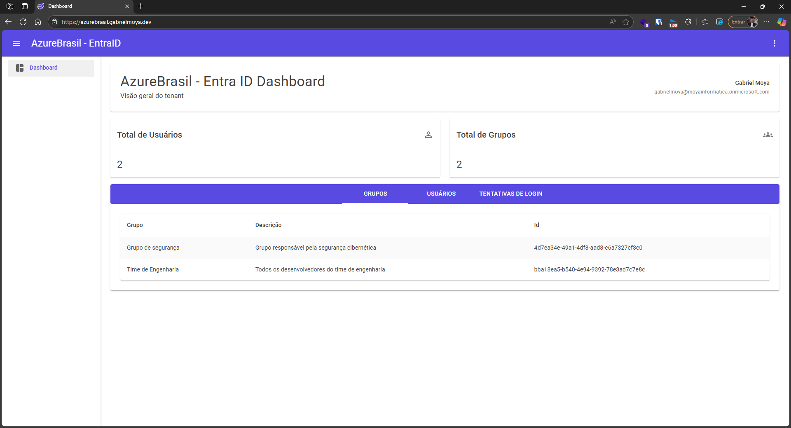
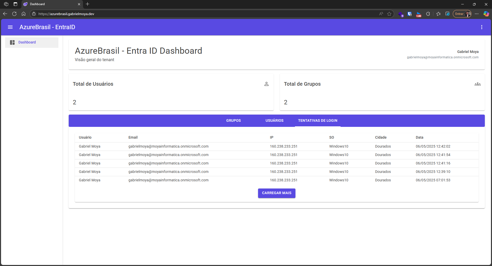
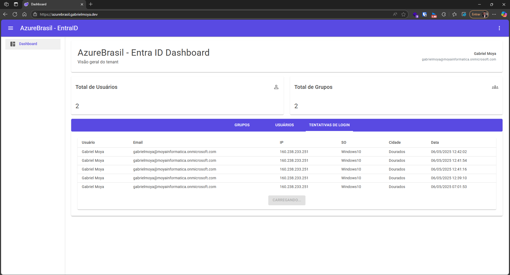

# AzureBrasil.Cloud - Blazor Server + Azure Entra ID

Projeto desenvolvido para demonstrar autenticação com Azure Entra ID e integração com a Microsoft Graph API, exibindo informações do tenant, usuários, grupos e tentativas de login.

---

## Tecnologias Utilizadas

* Blazor Server (.NET 8)
* Azure Entra ID (Microsoft Identity Platform)
* Microsoft Graph API
* Arquitetura em camadas (Domain, Application, Infrastructure, Web)
* CI/CD com GitHub Actions
* Testes de unidade com xUnit + Moq

---

## Executando o Projeto Localmente

### Pré-requisitos

* .NET SDK 8
* Conta no Azure com Azure Entra ID habilitado
* Licença premium do Entra ID (necessária para `AuditLog.Read.All`)
* Visual Studio ou VS Code

### Passos

1. Clone o repositório:

   ```bash
   git clone https://github.com/Gabriel-Moya/AzureBrasil-cloud.git
   cd AzureBrasil-Cloud
   ```

2. Adicione ao arquivo `appsettings.json` na pasta `.\src\AzureBrasil-cloud.Presentation` o seguinte conteúdo:

    ```json
    "AzureAd": {
        "Instance": "https://login.microsoftonline.com/",
        "Domain": "<seu-domain>",
        "TenantId": "<seu-tenant-id>",
        "ClientId": "<seu-client-id>",
        "ClientSecret": "<seu-client-secret>",
        "CallbackPath": "/signin-oidc"
    }
    ```

3. Execute a aplicação:

   ```bash
   dotnet run --project .\src\AzureBrasil-cloud.Presentation\ --launch-profile https
   ```

4. Acesse em: [https://localhost:7222](https://localhost:7222)

---

## Configuração do Azure Entra ID

1. **Crie um App Registration no portal do Azure:**

   Azure Portal → Azure Active Directory → App registrations → New registration

2. **Authentication:**

   * Plataforma: *Web*
   * Redirect URI: `https://localhost:7222/signin-oidc`
   * Marque **ID tokens (used for implicit and hybrid flows)**

3. **Certificates & Secrets:**

   * Acesse "Certificates & secrets" e clique em "New client secret"
   * Copie o valor gerado e adicione ao `appsettings.json`

4. **API Permissions:**

   Adicione as permissões delegadas da Microsoft Graph:

   * `User.Read`
   * `Directory.Read.All`
   * `AuditLog.Read.All` (requer licença premium)
   * `Group.Read.All`

   Em seguida, clique em **"Grant admin consent for \[sua organização]"**

---

## Funcionalidades

* Autenticação via Entra ID com fluxo OpenID Connect
* Exibição das informações do usuário autenticado:

  * Nome
  * Email
  * ID do Tenant
* Informações adicionais do Tenant:

  * Lista de usuários
  * Lista de grupos
  * Tentativas de login recentes (paginação inclusa)

---

## Screenshots

### Grupos


### Usuários


### Tentativas de login


### Tentativas de login (carregando)


---

## Testes

Todos os serviços da camada Application possuem cobertura de testes unitários com xUnit:

```bash
dotnet test
```

---

## CI/CD

Este projeto inclui pipelines separados para:

* `CI`: build e execução dos testes
* `CD`: publicação automática para o Azure App Service

Arquivos: `.github/workflows/ci.yml` e `.github/workflows/cd.yml`

Configuração necessária:

```yaml
with:
  app-name: <NomeDoSeuAppService>
  publish-profile: ${{ secrets.AZURE_WEBAPP_PUBLISH_PROFILE }}
  package: ./publish
```

---

## Projeto em Produção

O projeto está hospedado no Azure App Service e pode ser acessado em: [http://azurebrasil.gabrielmoya.dev](http://azurebrasil.gabrielmoya.dev)

> Observação: O login está restrito a usuários previamente cadastrados no Azure Entra ID com permissões específicas.
Caso deseje testar a aplicação com credenciais válidas, entre em contato comigo pelo [LinkedIn](https://www.linkedin.com/in/gabriel-moya/) para que eu possa compartilhá-las de forma privada.
